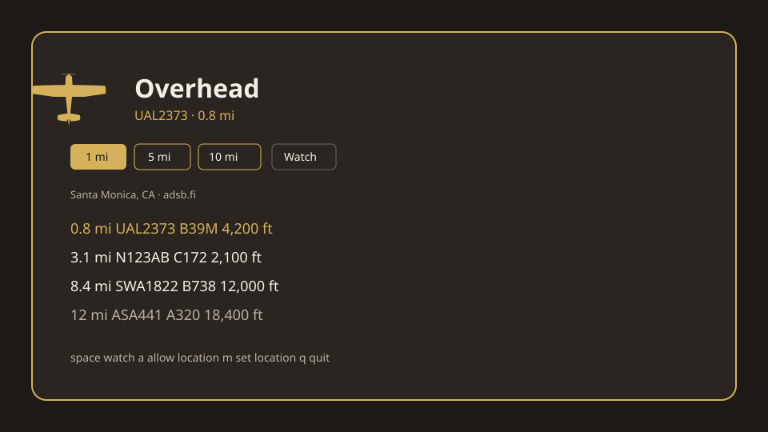

# Overhead for Omarchy

A small TUI and an Omarchy Quattro bar plugin that watches live ADS-B traffic around you and pops a desktop message when a plane comes within **1**, **5**, or **10** miles.



Plugin id: `io.github.mohuddle.overhead`

## What it does

- Asks before using location (desktop portal or GeoClue). You can also type coordinates or a place name. IP geolocation is not used — it is too coarse for 1-mile alerts.
- Pulls live aircraft from public ADS-B feeds in the same JSON family as [globe.adsbexchange.com](https://globe.adsbexchange.com/) (`adsb.fi`, then `adsb.lol`, then OpenSky).
- Lists nearby flights in the TUI and the bar popup.
- Notifies once per aircraft per ring (1 / 5 / 10 miles) until that plane leaves.

Location is stored only under `~/.local/state/omarchy/overhead/`. The ADS-B query is a lat/lon radius — nothing else about you is sent. See [NOTICE.md](NOTICE.md).

## Install

```bash
git clone https://github.com/mohuddle/omarchy-overhead.git
cd omarchy-overhead
./scripts/setup.sh
```

That links `overhead` on `~/.local/bin` and copies the bar widget into `~/.config/omarchy/plugins/`.

Place the widget:

```bash
omarchy bar move io.github.mohuddle.overhead --section right
```

No extra Python packages. Python 3.10+ and an Omarchy desktop are enough.

## TUI

```bash
overhead tui
```

| Key | Action |
| --- | --- |
| `a` | allow location (desktop portal / GeoClue) |
| `m` | type coordinates (`34.05, -118.24`) or a place name |
| `space` | start / stop watching |
| `1` / `5` / `0` | toggle 1 / 5 / 10 mile rings |
| `n` | notifications on / off |
| `r` | fetch now |
| `c` | clear stored location |
| `q` | quit |

The first run stays idle until you allow location or set one manually.

## Plugin

Left click the plane: popup with nearby traffic, ring toggles, Watch / Notify / TUI. Right click toggles watching without opening the panel. The icon uses the theme accent while something is inside 1 mile.

Clicking a notification opens the panel.

## CLI

```bash
overhead start
overhead stop
overhead status
overhead locate
overhead location 34.05 -118.24
overhead location "Santa Monica, CA"
overhead location --clear
overhead rings 1,5,10
overhead notify on
```

## Data

```
~/.local/state/omarchy/overhead/config.json
~/.local/state/omarchy/overhead/status.json
```

Grounded aircraft, and anything below 500 ft, are ignored for toasts so a nearby airport does not spam you. The list still shows them. Distances are statute miles. At most one notification is sent per poll, and not more often than every 8 seconds.

**Allow** needs [GeoClue](https://gitlab.freedesktop.org/geoclue/geoclue). Omarchy does not ship it, and the Hyprland portal does not implement Location, so the button fails until you install the backend:

```bash
omarchy pkg add geoclue
```

Then press **Allow** again. If GeoClue still cannot fix a position, type coordinates or a place name. Manual entry does not need GeoClue.

## Remove

```bash
omarchy plugin remove io.github.mohuddle.overhead
rm -f ~/.local/bin/overhead
rm -rf ~/.local/state/omarchy/overhead
```

## Development checks

```bash
omarchy plugin validate plugin
node tests/model.test.js
python3 tests/test_overhead.py
```

## License

MIT. See [LICENSE](LICENSE). ADS-B feed terms are their own; this project does not scrape ADS-B Exchange's globe.
