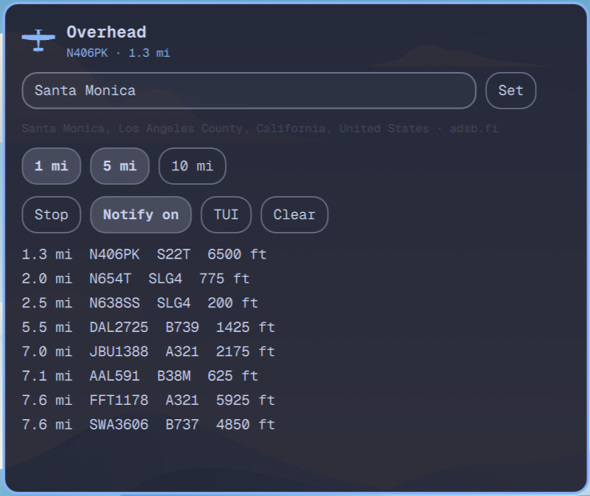

# Overhead for Omarchy

A small TUI and an Omarchy Quattro bar plugin that watches live ADS-B traffic around you and pops a desktop message when a plane comes within **1**, **5**, or **10** miles.




Plugin id: `io.github.mohuddle.overhead`

## What it does

- You type a **ZIP, city, or coordinates**. That is the whole location story for a normal install. Nothing on the machine reports where you are.
- **Device location is optional.** GeoClue is not a dependency. Install it later only if you want the Device button.
- Pulls live aircraft from public ADS-B feeds in the same JSON family as [globe.adsbexchange.com](https://globe.adsbexchange.com/) (`adsb.fi`, then `adsb.lol`, then OpenSky).
- Lists nearby flights in the TUI and the bar popup.
- Notifies once per aircraft per ring (1 / 5 / 10 miles) until that plane leaves.

Location is stored only under `~/.local/state/omarchy/overhead/`. The ADS-B query is a lat/lon radius — nothing else about you is sent. See [NOTICE.md](NOTICE.md).

## Install

```bash
omarchy plugin add https://github.com/mohuddle/omarchy-overhead.git --enable
```

That clones the widget and the TUI into `~/.config/omarchy/plugins/`. Put `overhead` on your PATH if you want the CLI outside the bar:

```bash
~/.config/omarchy/plugins/io.github.mohuddle.overhead/scripts/setup.sh
```

Move the widget:

```bash
omarchy bar move io.github.mohuddle.overhead --section right
```

No extra Python packages. No GeoClue. Python 3.10+ and an Omarchy desktop are enough.

## TUI

```bash
overhead tui
```

| Key | Action |
| --- | --- |
| `m` | ZIP, city, or coordinates |
| `a` | device location (only if GeoClue is installed) |
| `space` | start / stop watching |
| `1` / `5` / `0` | toggle 1 / 5 / 10 mile rings |
| `n` | notifications on / off |
| `r` | fetch now |
| `c` | clear stored location |
| `q` | quit |

The first run stays idle until you set a ZIP, city, or coordinates.

## Plugin

Left click the plane: ZIP/city field, nearby traffic, ring toggles, Watch / Notify / TUI. The Device button appears only when GeoClue is already on the machine. Right click toggles watching. The icon uses the theme accent while something is inside 1 mile.

Clicking a notification opens the panel.

## CLI

```bash
overhead start
overhead stop
overhead status
overhead location 72714
overhead location "Santa Monica, CA"
overhead location 34.05 -118.24
overhead locate              # optional; needs GeoClue
overhead location --clear
overhead rings 1,5,10
overhead notify on
```

## Data

```
~/.local/state/omarchy/overhead/config.json
~/.local/state/omarchy/overhead/status.json
```

Grounded aircraft, and anything below 500 ft, are ignored for toasts so a nearby airport does not spam you. The list still shows them. Distances are statute miles. At most one notification is sent per poll, and not more often than every 8 seconds.

## Optional device location

Skip this unless you want the machine to resolve your position. The app works fully with a ZIP or city.

```bash
omarchy pkg add geoclue
sudo cp scripts/geoclue-omarchy-overhead.conf /etc/geoclue/conf.d/
```

Hyprland has no Location portal. GeoClue is the only auto-locate backend, and it is never pulled in by `setup.sh`.

## Remove

```bash
omarchy plugin remove io.github.mohuddle.overhead
rm -f ~/.local/bin/overhead
rm -rf ~/.local/state/omarchy/overhead
```

## Development checks

```bash
omarchy plugin validate .
node tests/model.test.js
python3 tests/test_overhead.py
```

See [docs/CONTRIBUTING.md](docs/CONTRIBUTING.md).

## License

MIT. See [LICENSE](LICENSE). ADS-B feed terms are their own; this project does not scrape ADS-B Exchange's globe.
